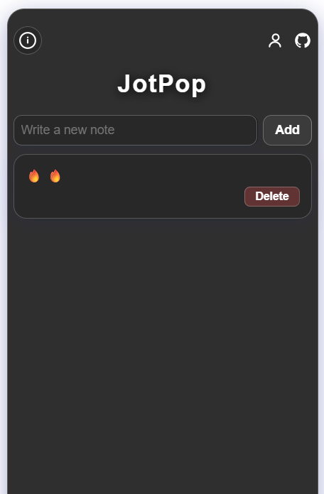
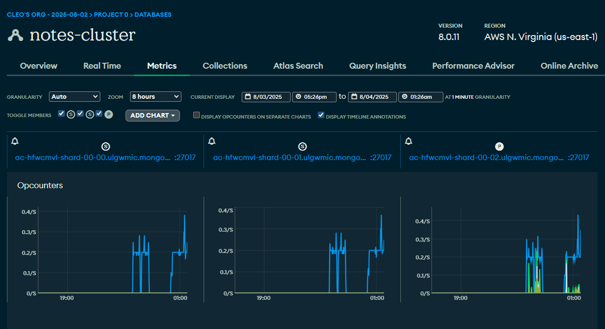
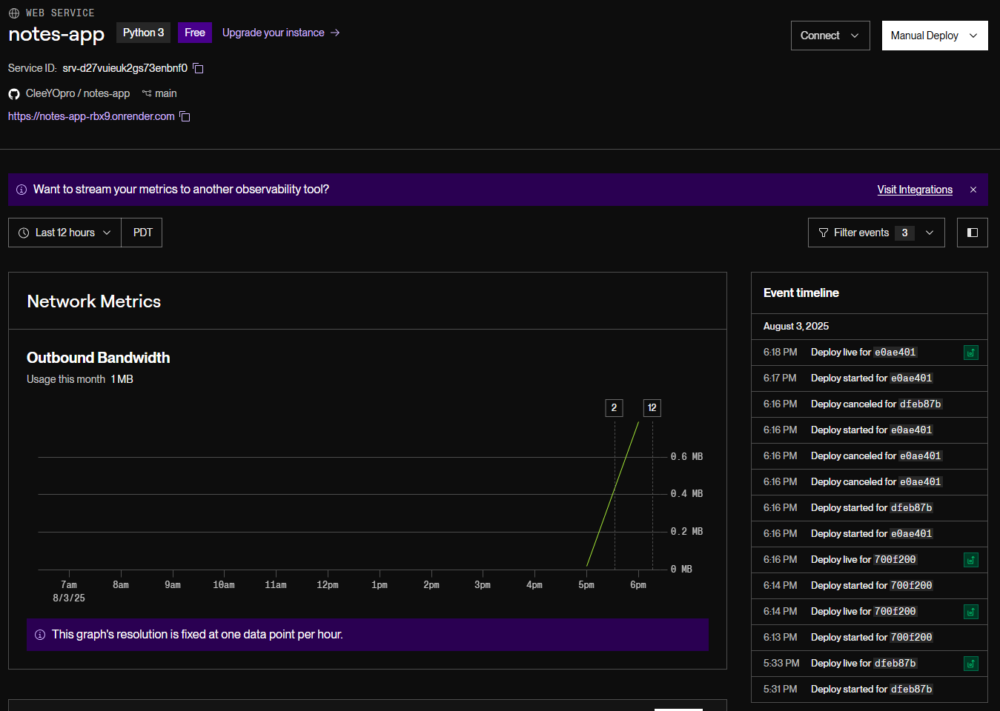
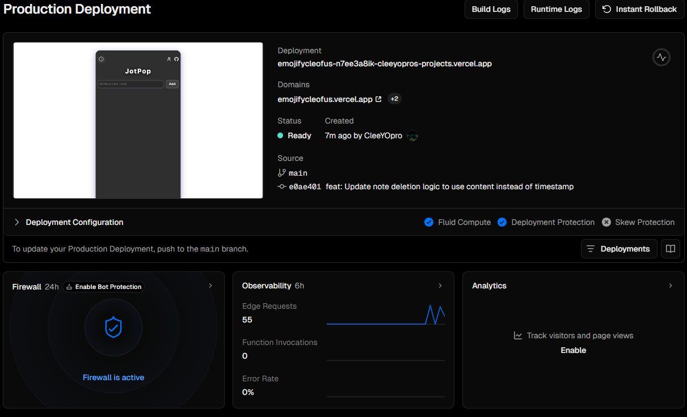

<p align="center">
  <br>
  <h1>JOTpop ✏️✨</h1>
</p>

<table>
  <tr>
    <td width="50%" valign="top">
      <strong>A simple full-stack notes app</strong> with a modern glassmorphism UI and emoji word replacement — built to explore cloud services and MongoDB for scaling bigger projects in the future.
    </td>
    <td width="50%">
      
    </td>
  </tr>
</table>

## 🚀 Why I Built This
I built **JOTpop** as a **learning project to master cloud services like  Render and  Vercel**, while integrating  **MongoDB Atlas** for a scalable backend database. This project helped me understand:
- How to deploy full-stack apps to cloud platforms
- Working with **MongoDB Atlas clusters** and managing databases in the cloud
- Backend development with **Flask and REST APIs**
- Frontend deployment on **Vercel** for rapid builds and custom domains
- Preparing for larger, more complex projects that will use similar cloud architecture

---

## 🔗 How It Works (Architecture)
```mermaid
graph TD;
    User(Device) -->|Request| Frontend[Vercel (React App)]
    Frontend -->|API Calls| Backend[Render (Flask API)]
    Backend -->|Database Ops| MongoDBAtlas[MongoDB Atlas Cluster]
    Backend -->|Returns Data| Frontend
    Frontend -->|Shows Notes| User
```

---

## ✨ Features
- Add and delete notes from any device, anywhere, anytime
- Notes are saved in  MongoDB Atlas and globally accessible
- Type words like `joy`, `party`, or `cake` — they turn into emojis automatically!
- Sleek dark glassmorphism UI, mobile-friendly

---

## 🖥️ Screenshots
<p align="center">
  
  &nbsp;&nbsp;&nbsp;
  
  &nbsp;&nbsp;&nbsp;
  
</p>

---

## 🛠️ Getting Started

### Backend 
1. **Install dependencies:**
    ```bash
    pip install flask flask-cors pymongo
    ```
2. **Set your MongoDB URI as an environment variable:**
    ```bash
    export MONGODB_URI="your-mongodb-uri"
    ```
3. **Run the backend:**
    ```bash
    python app.py
    ```

### Frontend 
1. **Install dependencies:**
    ```bash
    npm install
    ```
2. **Start the frontend:**
    ```bash
    npm start
    ```

---

## 📝 Usage Instructions
- Open the app in your browser.
- Add notes from any device, anywhere, anytime!
- Delete notes instantly with one click.
- Type words like `party`, `cake`, or `joy` and watch them turn into emojis automatically.
- All notes are saved in the cloud and visible to everyone using the app.
- The app works great on desktop and mobile devices.

---

## 🌐 Links
- [Live App](#) <!-- Replace # with your Vercel URL -->
- [GitHub Repo](https://github.com/CleeYOpro/notes-app.git)
- [MongoDB Atlas](https://www.mongodb.com/atlas/database)
- [Render Dashboard](https://dashboard.render.com/)
- [Vercel Dashboard](https://vercel.com/dashboard)

---

## ⚡ Stack Used
- React.js ( Vercel hosted)
- Flask (Python) ( Render hosted)
-  MongoDB Atlas
- Axios (HTTP Client)
- Glassmorphism UI Design

---

### What next?
→ Replace the `#` in `[Live App](#)` with your Vercel URL.  
→ Add your screenshots inside a `/screenshots` folder in the repo.  
→ Commit & Push this README.md.
